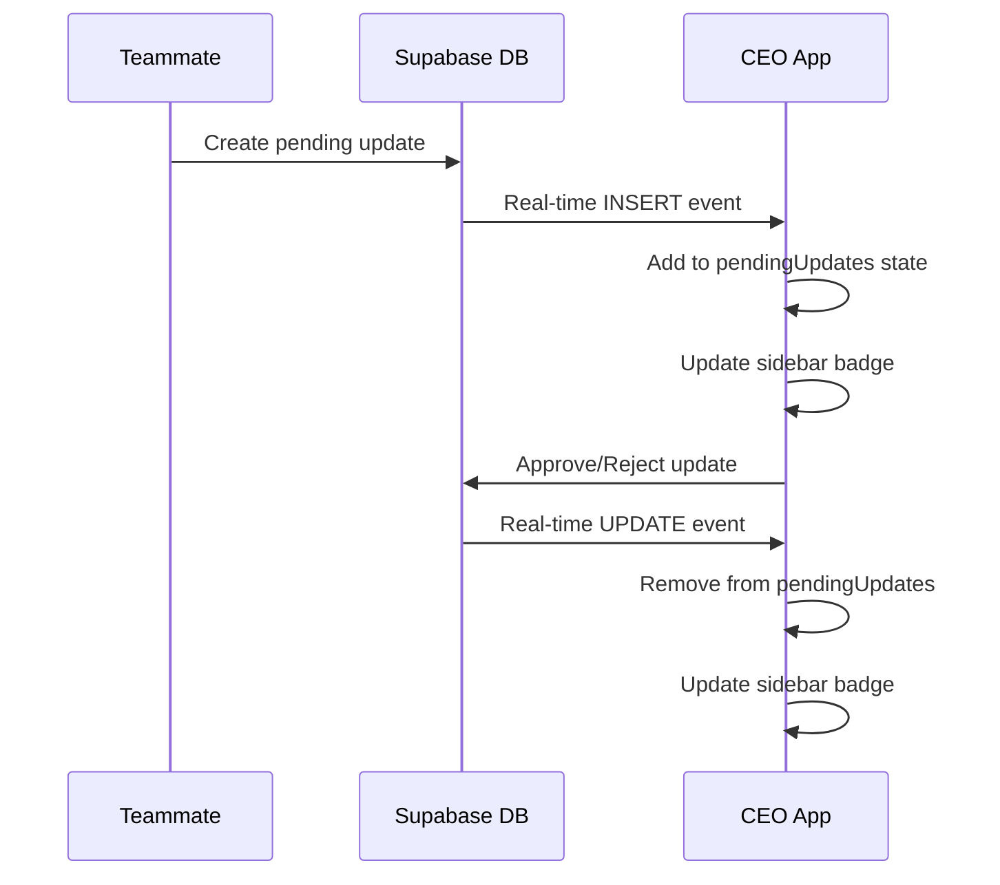

# Real-Time Pending Approvals System Setup Guide

## Summary

This guide explains how to set up the real-time pending approvals system for your WebWizBD ERP application so that the CEO sees approval requests immediately when teammates make changes.

## Problem Solved

Before this implementation:
- ❌ `pendingUpdates` were stored only in localStorage
- ❌ CEO's approvals page didn't show pending requests from teammates
- ❌ No real-time updates when approval requests were created

After this implementation:
- ✅ `pendingUpdates` are stored in Supabase database
- ✅ Real-time subscriptions show new approvals immediately
- ✅ CEO sees approval requests instantly on the Approvals page
- ✅ Sidebar badge updates in real-time

## Database Setup

### 1. Existing Tables

The database already has these required tables:
- `pending_updates` - Stores approval requests
- `teammates` - User management
- `tasks` - Task data
- `projects` - Project data  
- `notifications` - Notification system

### 2. Missing Table (Need to Add)

You need to create the `announcements` table. Run this SQL in your Supabase database:

```sql
-- Create announcements table
CREATE TABLE announcements (
    id UUID PRIMARY KEY DEFAULT uuid_generate_v4(),
    title VARCHAR(255) NOT NULL,
    content TEXT NOT NULL,
    priority VARCHAR(20) NOT NULL DEFAULT 'medium',
    target_audience VARCHAR(20) NOT NULL DEFAULT 'all',
    target_roles JSONB DEFAULT '[]',
    created_by UUID REFERENCES teammates(id) ON DELETE SET NULL,
    created_at TIMESTAMP WITH TIME ZONE DEFAULT NOW(),
    expires_at TIMESTAMP WITH TIME ZONE,
    is_active BOOLEAN DEFAULT true,
    viewed_by JSONB DEFAULT '[]',
    updated_at TIMESTAMP WITH TIME ZONE DEFAULT NOW()
);

-- Add indexes for performance
CREATE INDEX idx_announcements_created_by ON announcements(created_by);
CREATE INDEX idx_announcements_created_at ON announcements(created_at);
CREATE INDEX idx_announcements_priority ON announcements(priority);
CREATE INDEX idx_announcements_target_audience ON announcements(target_audience);
CREATE INDEX idx_announcements_is_active ON announcements(is_active);
CREATE INDEX idx_announcements_expires_at ON announcements(expires_at);
CREATE INDEX idx_announcements_viewed_by ON announcements USING GIN (viewed_by);
CREATE INDEX idx_announcements_target_roles ON announcements USING GIN (target_roles);
```

## Code Changes Made

### 1. App.tsx Updates

#### State Management Changes:
- ✅ Changed `pendingUpdates` from localStorage to database loading
- ✅ Added `pendingUpdatesLoaded` state flag
- ✅ Added database loading on app startup

#### Real-time Subscriptions Added:
- ✅ Real-time subscription to `pending_updates` table
- ✅ Automatic UI updates when new approval requests arrive
- ✅ Automatic removal when requests are approved/rejected

#### Database Integration:
- ✅ All `setPendingUpdates` calls now use `DatabaseOperations.createPendingUpdate()`
- ✅ Approval/rejection updates database status
- ✅ Fallback to localStorage if database fails

### 2. Functions Updated

#### Pending Update Creation:
- `handleRequestRoleChange()` - Role change requests
- `handleUpdateProject()` - Project edit requests  
- `handleEditTask()` - Task edit requests
- `handleProjectTaskUpdate()` - Project task updates
- `handleDeleteTask()` - Task deletion requests

#### Pending Update Processing:
- `handleApproveUpdate()` - Updates database status to 'approved'
- `handleRejectUpdate()` - Updates database status to 'rejected'

## How It Works Now

### 1. When Teammate Requests Changes

1. **Task Edit Example:**
   ```typescript
   // Before: Only localStorage
   setPendingUpdates(prev => [...prev, newUpdate]);
   
   // After: Database + Real-time
   const createdUpdate = await DatabaseOperations.createPendingUpdate(newUpdateData);
   setPendingUpdates(prev => [createdUpdate, ...prev]);
   ```

2. **Real-time Notification:**
   - Database insert triggers Supabase real-time event
   - All connected clients receive the update instantly
   - CEO's sidebar badge count updates immediately
   - CEO's Approvals page shows new request

### 2. When CEO Approves/Rejects

1. **Approval Process:**
   ```typescript
   // Updates database status
   const result = await DatabaseOperations.updatePendingUpdate({
     ...update,
     status: 'approved',
     resolvedAt: new Date().toISOString(),
     resolvedBy: currentUser.id,
   });
   
   // Removes from local pending list (no longer pending)
   setPendingUpdates(prev => prev.filter(u => u.id !== updateId));
   ```

2. **Real-time Removal:**
   - Database update triggers real-time event
   - Request disappears from all CEO sessions
   - Sidebar badge count decreases automatically

## Real-time Event Flow



## Testing the Implementation

### 1. Test Approval Request Creation
1. Login as a non-CEO teammate
2. Edit a task that's "In Progress" (requires CEO approval)
3. CEO should see:
   - Sidebar badge count increase immediately
   - New request appear in Approvals page instantly

### 2. Test Approval Processing  
1. Login as CEO
2. Go to Approvals page
3. Approve or reject a request
4. Request should disappear immediately
5. Sidebar badge count should decrease

### 3. Test Multiple Sessions
1. Open CEO account in multiple browser windows
2. Create approval request from teammate account
3. All CEO windows should update simultaneously

## Troubleshooting

### Issue: Approvals not appearing
**Check:**
- Database has `pending_updates` table
- Supabase real-time is enabled
- App.tsx has real-time subscription active
- `pendingUpdatesLoaded` is true

### Issue: Badge count not updating
**Check:**
- Sidebar component receives `pendingUpdates` prop
- Real-time subscription is processing INSERT events
- `setPendingUpdates` is being called in real-time handlers

### Issue: Database errors
**Check:**
- All required tables exist (`pending_updates`, `teammates`, etc.)
- Foreign key constraints are satisfied
- Supabase connection is active

## Environment Requirements

### Supabase Configuration
- Real-time subscriptions enabled
- Row Level Security (RLS) configured appropriately
- Database tables created with proper indexes

### App Dependencies
- `@supabase/supabase-js` client configured
- Real-time subscriptions working
- Database operations service functional

## Performance Considerations

### Database Indexes Added
- `idx_pending_updates_item_id` - For filtering by item
- Foreign key indexes on teammates references
- Composite indexes for common query patterns

### Real-time Optimization
- Filters only 'pending' status updates
- Subscription cleanup on component unmount
- Minimal payload data transfer

## Security Considerations

### Access Control
- Only CEO can approve/reject updates
- Users can only create updates for their own requests
- Database RLS policies should restrict access appropriately

### Data Validation
- All pending updates validated before database insert
- Status changes restricted to valid transitions
- User permissions checked before operations

## Maintenance

### Monitoring
- Watch for failed database operations
- Monitor real-time subscription health
- Check for orphaned pending updates

### Cleanup
- Consider archiving old resolved updates
- Monitor database size growth
- Regular cleanup of expired requests

## Next Steps

1. **Test thoroughly** with multiple user scenarios
2. **Monitor performance** in production environment  
3. **Add error handling** for edge cases
4. **Consider notifications** for approved/rejected requests
5. **Add audit logging** for approval decisions

## Summary

The implementation provides:
- ✅ Real-time approval request notifications
- ✅ Database persistence for reliability  
- ✅ Automatic UI updates across all sessions
- ✅ Proper cleanup when requests are processed
- ✅ Fallback mechanisms for reliability

The CEO will now see approval requests immediately when teammates make changes that require approval, and the system works in real-time across all browser sessions.
